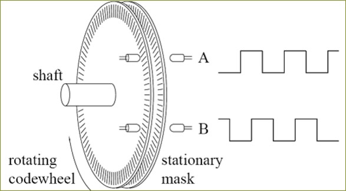
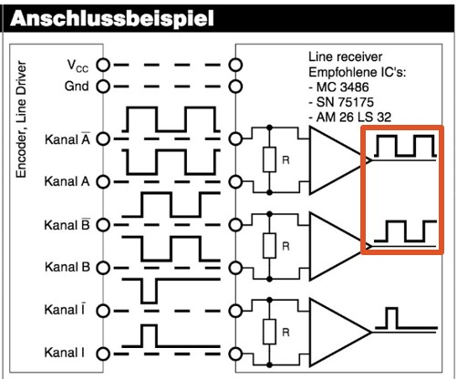
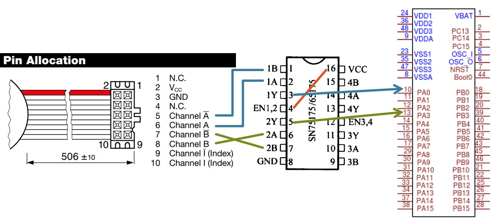
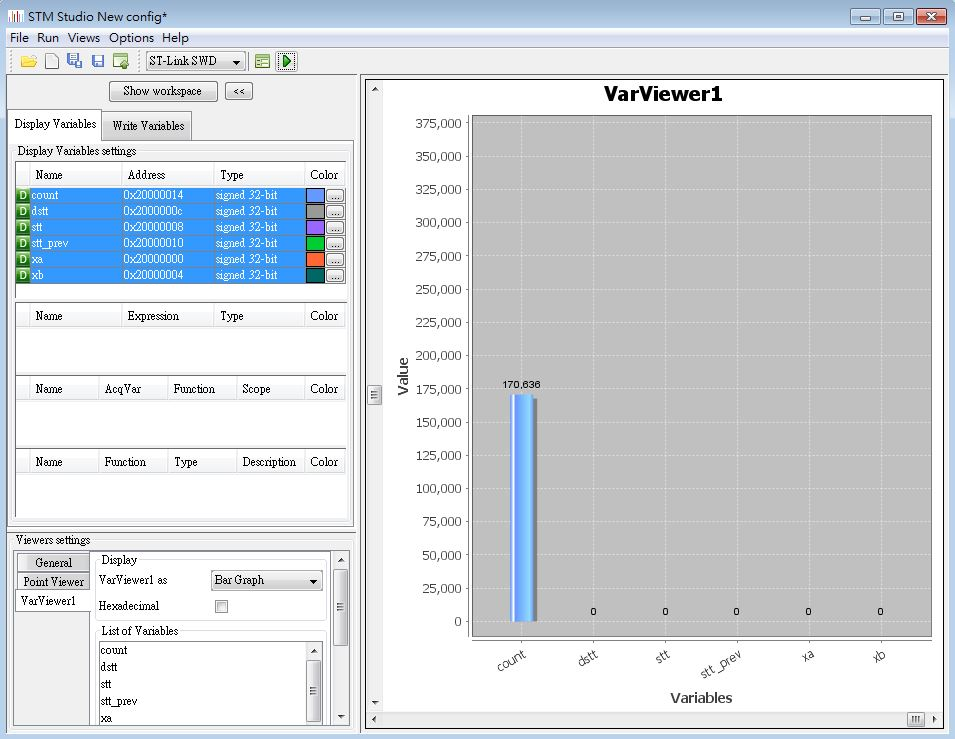

# STM32F0 Quadrature Encoder
## STM32F1 version with I2C Arduino communication
Please refer to this repository:  
https://github.com/wildcat5566/STM32F1_I2C_MotorModule  

## Rotary encoders
   
 
An optical encoder "channel" is composed of a pair of light (optical signal) emitter and receiver.  
The stationary codewheel has alternating opaque and transparent sections (stripes) on it. When optical signals are able to be received (i.e. between the emitter and receiver is a transparent section), the channel outputs a HIGH (1) digital signal. Otherwise the channel outputs a LOW (0) one.  
When our motor shaft starts rotating, the optical channels start to output HIGH and LOW signals alternatively, hence generates a square wave signal, shown in the image above.  
We detect triggers (both falling and rising edges) to determine occurance of a state transition.
 

## Encoder logic (1): State
   
 
A "Quadrature" encoder means that there are 2 channels (A, B) * 2 states (1, 0) = 4 possible combinations (states).  
Here I represent the encoder state with an XOR logic analogy, shown in the table in above image.  
 

## Encoder logic (2): Direction
   
 
What differs a quadrature encoder from a regular one (or with only one channel) is that with the extra channel, rotation direction of motor shaft can now be determined.  
We compare the current state with the previous one to determine the rotation direction. Details are described in the image above.  
 

## Maxon encoder observation
   
 
The motor we use is Maxon RE30. Installed encoder is with 256 lines resolution and a gear ratio of 110.  
Hence we should detect 256 * 4 (quadrature) * 110 = 112640 triggers per revolution.  
Before moving on to our microcontroller implementation, we should make an observation of our encoder output pins.  
According to product specs, shown in the image above, there are 2 output pins for optical channels A and B each, the "differential signaling" transmission technique is used. Details are described in next paragraph.  
 

## Differential signaling and corresponding IC SN75175
   
 
The pair of "complementary" differential signals have same wave profile but opposite magnitudes.  
By using the SN75175 IC illustrated above, we integrate the pair of complements by subtraction, hence gaining following benefits:  
- Amplify low voltage signals, i.e. V - (-V) = 2V  
- Robust against white and electromagnetic noise, since we subtract them out when combining the differential signals.  
 

## STM32F0 EXTI
EXTI stands for external interrupt and that's the library we use for the square wave edge/trigger detection.  
After reading the signal via a GPIO pin, we connect it to an event handler "line".
It's worth mentioning that for external interrupt handling, all pins sharing the same number share the same line, i.e. PA0, PB0, ... PG0 share line0. Therefore we need to choose separate lines for each square wave input.

## Hardware setup
   
 
FINALLY we are ready to move on to our circuit & hardware setup.  
Wiring of the motor encoder and SN75175 is illustrated abov.  
The two outputs (original A and B channel outputs) are connected to PA0 and PA3 on the STM32F0.  
 

## STM studio monitoring
   
